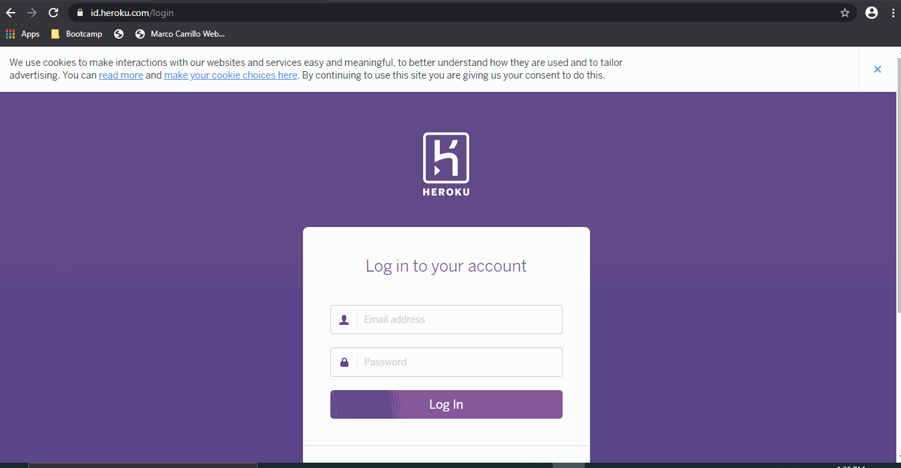

# Purpose of the application

The 'Eat-da-Burger' application is an application that uses the full stack to deliver an entertaining application.  Its practical application is to learn to orchestrate the different components of the stack rather than being a useful daily companion.  Nevertheless, it is one of the building blocks to implement the MCV architectual software development model  (model-view-controller).

## MCV model:  

Under this model, the user is agnostic to the data flow and data changes happening in the back server.  The back server, on the other hand, uses a modular approach to deliver, fulfill, and display changes executed from the user interface.

The application is deployed in three four main modules:

1. Model:  Model received the data from the controler, and is responsible for managing it.  In this case, in executing the right configuration and enforce business logic to execute the requested action from the UI.
2. Controler:  The controller receives the data from the user interface, and manipulates the data objects assuming validity.  It is the intergration layer between the UI and the data execution code.
3. View:  Responsible to interact with the customer and it could be represented as the user interface (UI).  The UI layer is primarily responsible to ensure all data entered is valid, and ultimately make a request from the back server to perform a specific function (add, modify, or delete).  In this case, we used Handlebars as our UI template, and JQuery to make requests from the back server.

The process is continous and fuid, the model continously interact between those three main modules.

## Functionality

The application allows three main options:

1.  Add a new burger.......:  User can enter any type of burgers they want as long as their name is 5 or more characters long.  Since multiple burgers of the same type could be consumed, the application doesn't check for duplicates, and allows to enter as many as the user apetizes.  The initial status of the newly created burger is "undevoured".  All "undervoured" burgers will be placed on the left side of the screen.
2.  Devour a burger........:  User can devour a burger by clicking the button attached to the burger.  When done so, the burger will move from the left to the right-hand side part of the screen.
3.  Undevour a burger......:  Not exactly sure how this would be done in real life, but let's just say the user keeping track of the burgers devoured made a mistake and try to put it back to the undevour pile.  User can click on the attached "Undevour" button next to the burger name to accomplish this task.
4.  Delete a burger........:  Each burger can be delted whether in devoured or undevoured status.  Just click the "Delete" button next to the burger name and Voila!!.

##  Deployment to Heroku

This application has been fully deployed to Heroku.  We used the Jaws DB MySQL add-on to power the MySQL database required.  

The code has been retrofitted to detect the enviromental variable JAWSDB_URL, and if present will conect to its database server.  Otherwise, will connect to the local MySQL server implementation.

Click on the following link to be directed:  https://burger-express.herokuapp.com/

##  Update of personal portfolio website

The personal portfolio section of my personal page has been updated to include this new application.

Click on the following link to be directed:  https://marco-carrillo.github.io/Homework7-Portfolio/

## Full demonstration

The following GIF provides a demo, starting from the Heroku webpage, calling the application, showing its functionality, and then showing how it is called from the personal web page under the portfolio section.

